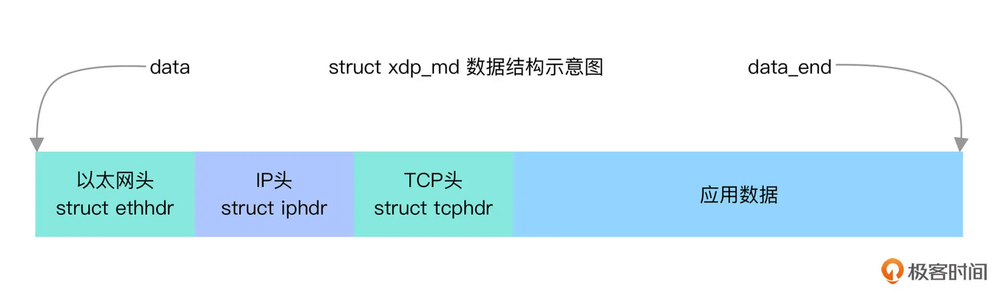

# traffic_controller

## compile

```shell
$ make libbpf
$ make vmliunx
$ make 
$ ./traffic_controller
Tracing /sys/kernel/debug/tracing/trace_pipe...
```

## 原理分析

该程序通过traffic control hook跟踪的方式将TCP目的端口为80的网络包丢弃,并将信息打印到系统调试信息中；

这是/include/uapi/linux/bpf.h中__sk_buff数据结构的定义:

```C
/* user accessible mirror of in-kernel sk_buff.
 * new fields can only be added to the end of this structure
 */
struct __sk_buff {
	__u32 len;
	__u32 pkt_type;
	__u32 mark;
	__u32 queue_mapping;
	__u32 protocol;
	__u32 vlan_present;
	__u32 vlan_tci;
	__u32 vlan_proto;
	__u32 priority;
	__u32 ingress_ifindex;
	__u32 ifindex;
	__u32 tc_index;
	__u32 cb[5];
	__u32 hash;
	__u32 tc_classid;
	__u32 data;
	__u32 data_end;
	__u32 napi_id;

	/* Accessed by BPF_PROG_TYPE_sk_skb types from here to ... */
	__u32 family;
	__u32 remote_ip4;	/* Stored in network byte order */
	__u32 local_ip4;	/* Stored in network byte order */
	__u32 remote_ip6[4];	/* Stored in network byte order */
	__u32 local_ip6[4];	/* Stored in network byte order */
	__u32 remote_port;	/* Stored in network byte order */
	__u32 local_port;	/* stored in host byte order */
	/* ... here. */

	__u32 data_meta;
	__bpf_md_ptr(struct bpf_flow_keys *, flow_keys);
	__u64 tstamp;
	__u32 wire_len;
	__u32 gso_segs;
	__bpf_md_ptr(struct bpf_sock *, sk);
	__u32 gso_size;
};
```

