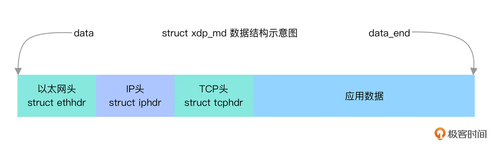

# xdp

## compile

```shell
$ make libbpf
$ make vmliunx
$ make 
$ ./xdp
Successfully started! Tracing /sys/kernel/debug/tracing/trace_pipe...
            Xorg-212399  [001] d.s.1 227674.562518: bpf_trace_printk: packet size: 60
          <idle>-0       [001] d.s.1 227675.260958: bpf_trace_printk: packet size: 90
```

## 原理分析

该程序通过xdp hook跟踪的方式获取网络包的大小,并将获取到的信息打印到系统调试信息中；

这是/include/uapi/linux/bpf.h中xdp_md数据结构的定义:

```C
/* User return codes for XDP prog type.
 * A valid XDP program must return one of these defined values. All other
 * return codes are reserved for future use. Unknown return codes will
 * result in packet drops and a warning via bpf_warn_invalid_xdp_action().
 */
enum xdp_action {
	XDP_ABORTED = 0,
	XDP_DROP,
	XDP_PASS,
	XDP_TX,
	XDP_REDIRECT,
};

/* user accessible metadata for XDP packet hook
 * new fields must be added to the end of this structure
 */
struct xdp_md {
	__u32 data;
	__u32 data_end;
	__u32 data_meta;
	/* Below access go through struct xdp_rxq_info */
	__u32 ingress_ifindex; /* rxq->dev->ifindex */
	__u32 rx_queue_index;  /* rxq->queue_index  */

	__u32 egress_ifindex;  /* txq->dev->ifindex */
};
```

